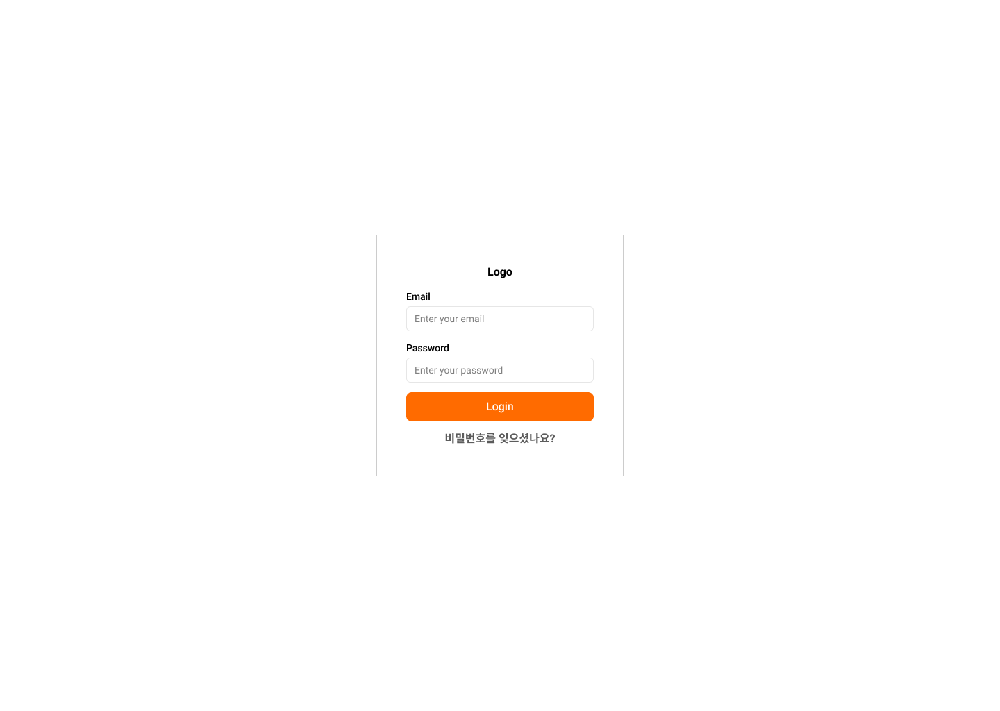
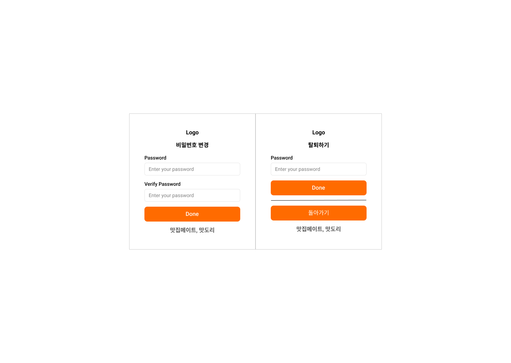
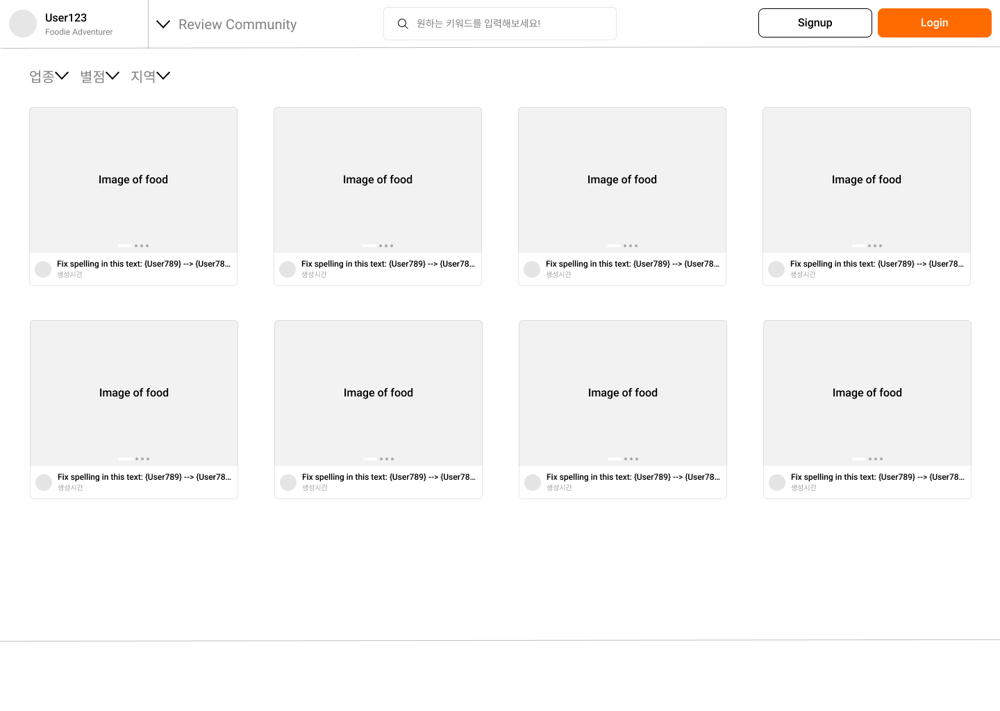
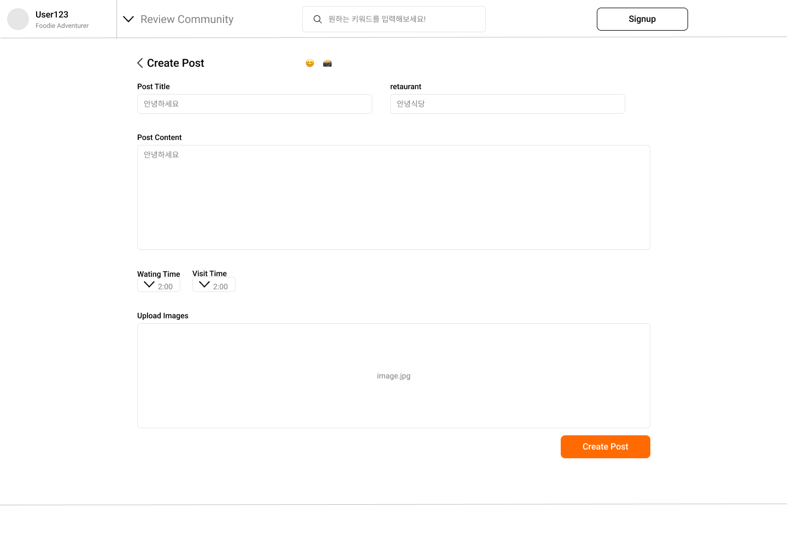
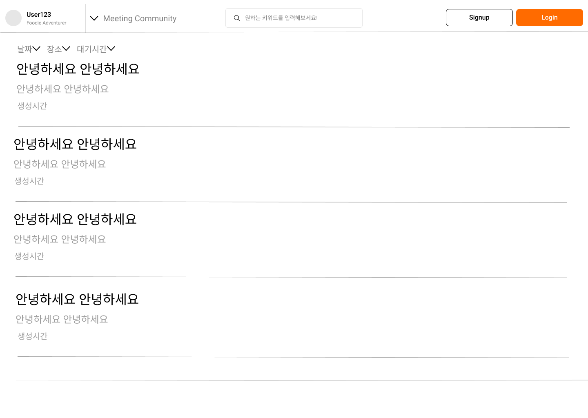
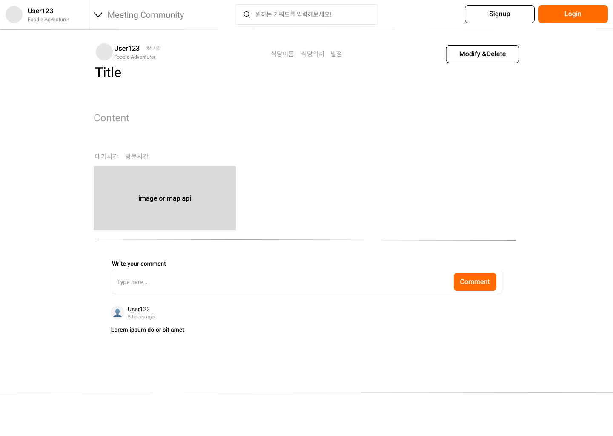
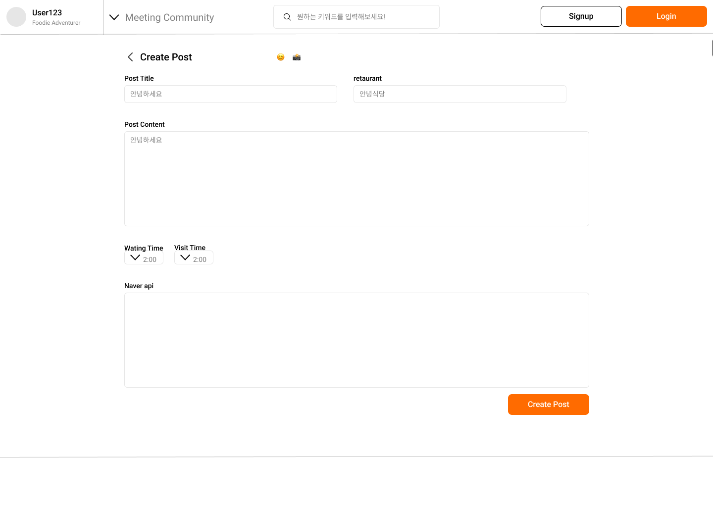
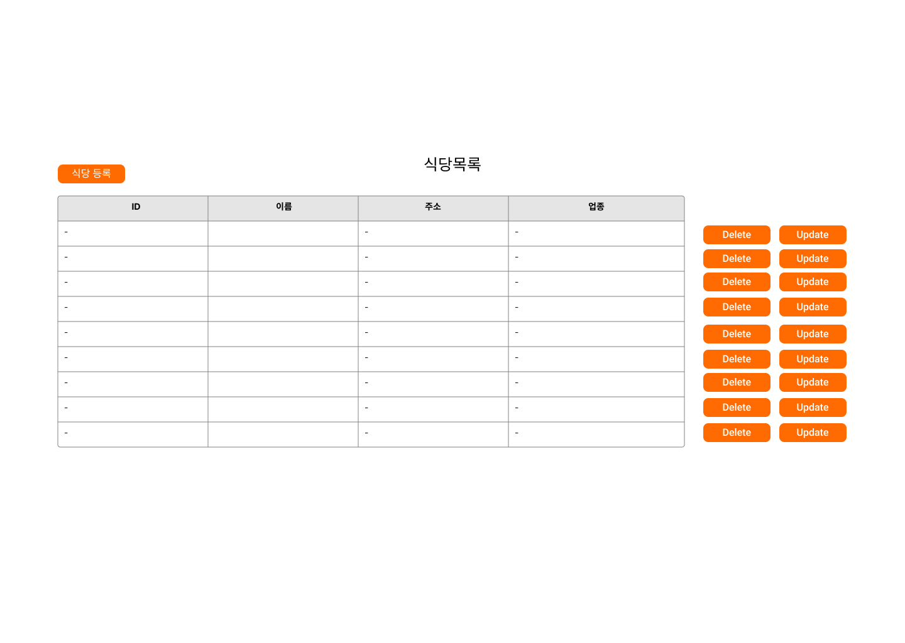
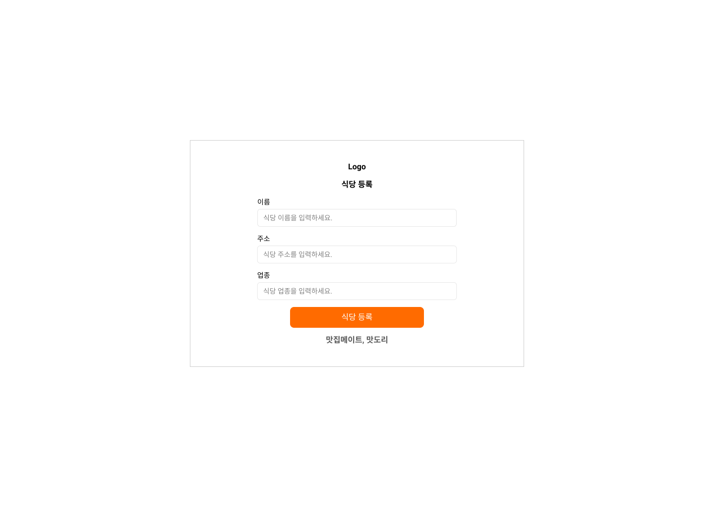
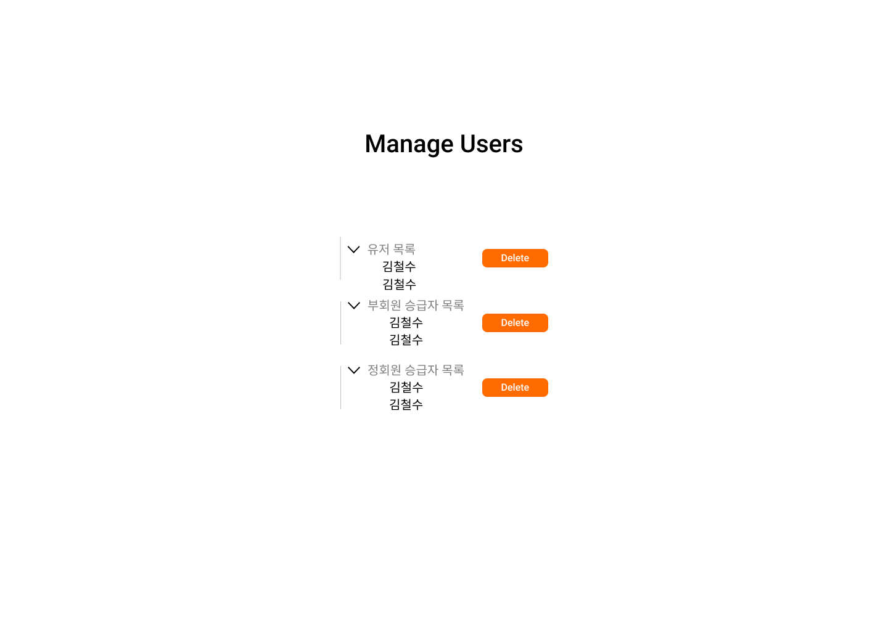

# matdori
- 스프링 부트 _ 맛집 탐방 커뮤니티
- [배포 URL](http://43.202.207.158:8080)

## 🖥️ 1. 프로젝트 소개
이 프로젝트는 Spring 기반의 맛집 탐방 커뮤니티 웹 애플리케이션입니다. <br>
사용자들은 맛집 정보를 공유하고 의견을 나눌 수 있는 플랫폼을 제공합니다.
<br>

## 🕰️ 2. 개발 기간
* 팀편성 발표: 03/18(월)
* 팀빌딩 기간: 03/18(월) ~ 03/22(금)
* 팀확정 및 역할 확정: ~ 03/22(금)
* 프로젝트 일정: 03/25(월) ~ 04/08(월)
* 프로젝트 발표: 04/09(화)

## 🧑‍🤝‍🧑 3. 멤버 구성
- 안태규 (팀장)
- 조창현 (팀원)
- 송재훈 (팀원)
- 하태민 (팀원) 

## ⚙️ 4. 개발 환경
- **Java** : 
- **IDE** : 
- **Framework** : 
- **Database** :  ,, 
- **Server** : 
- **WS/WAS** : 
- **Meeting** : , <a href="https://www.notion.so/oreumi/13-ad824ce6537d40ea965e67bef0a8988e?pvs=4"> </a>
- **Front-end** : , , ,  


## 🔨 5. 프로젝트 구조
```
.
├── src
│   ├── main
│   │   ├── java
│   │   │   └── com
│   │   │       └── estsoft13
│   │   │           └── matdori
│   │   │               ├── config              # 애플리케이션 설정 클래스들
│   │   │               ├── controller          # 컨트롤러 클래스들
│   │   │               ├── domain              # 도메인 모델 클래스들
│   │   │               ├── dto                 # 데이터 전송 객체 클래스들
│   │   │               ├── repository          # 데이터베이스 액세스를 위한 레포지토리 클래스들
│   │   │               ├── service             # 비즈니스 로직을 처리하는 서비스 클래스들
│   │   │               ├── util                # 유틸리티 클래스들
│   │   │               └── MatdoriApplication.java    # 애플리케이션의 메인 클래스
│   │   └── resources
│   │       ├── static          # 정적 파일(css, js 등)
│   │       ├── templates       # Thymeleaf 템플릿 파일들
│   │       ├── application.properties  # 애플리케이션 설정 파일
│   │       └── data.sql
│   └── test
│       └── java
│           └── com
│               └── estsoft13
│                   └── matdori
│                       └── controller     # 컨트롤러 테스트 클래스들
│                       └── repository     # 레포지토리 테스트 클레스들
│                       └── MatdoriApplicationTests
│  
├── build           # 빌드된 파일들이 생성되는 디렉터리
├── build.gradle    # Gradle 프로젝트 설정 파일
└── README.md       # 프로젝트 README 파일
```
## 6. UI 설계
[figma_link](https://www.figma.com/file/5fH89WuGk7gOUOeYj6DW4T/MATDORI?type=design&node-id=0-1&mode=design&t=opzCsn0Xf5dU5otQ-0)

|||
|-|-|
|로그인 화면|내 정보 화면|
|비밀번호 찾기 화면|로그인 화면|
|리뷰 메인 화면|리뷰 상세 화면|
|리뷰 등록, 수정 화면|모임 모집 게시글 화면|
|모임 게시판 상세 화면|모임 모집 등록, 수정 화면|
|식당 관리 메인 화면|식당 추가, 수정 화면|
|유저 관리 화면|

## 7. ERD 설계
[dbdiagram](https://dbdiagram.io/d/65fd42f6ae072629ceb1274d)


## 8. API 명세
- [Swagger](http://43.202.207.158:8080/swagger-ui/index.html)
- [Notion-Api명세](https://www.notion.so/oreumi/API-92bc8b4dd74b4f67b48b21f6dce182a6)

## 📌 9. 주요 기능
### 공통
- 회원 접근 가능
  - redirection -> 로그인 페이지 (비회원)
### 리뷰 게시판
- 비회원: 리뷰 조회만 가능
- Beginner, Associate, Member: 리뷰 작성, 수정, 삭제 가능


- 리뷰 작성
  - 회원 접근 가능
  - 작성 버튼
    - redirection : 작성 페이지
    - 작성 페이지
      - 제목, 날짜, 내 점수, 식당, 내용, 방문 시간, 예상 대기 시간, 사진
      - 등록 버튼
        - redirection -> 해당 글의 상세 페이지
        - dialog : '등록이 완료되었습니다.'
- 리뷰 조회
  - 모두 접근 가능
  - 리뷰 배치
    - 최신순
    - 평점순 
    - 조회순 
  - 게시글 "View Review" 버튼
    - 해당 글의 상세 페이지로 이동
    

- 리뷰 수정
  - 작성자 접근 가능
  - 해당 글의 상세 페이지에 버튼 구현
  - 수정 버튼
    - redirection -> 해당 글의 수정 페이지
    - dialog : '수정이 완료되었습니다.'


- 리뷰 삭제
  - 작성자 접근 가능
  - 해당 글의 상세 페이지에 버튼 구현
  - 삭제 버튼
    - redirection -> 리뷰 게시판
    - dialog : '삭제가 완료되었습니다.'
  

- 리뷰 검색
  - 조회시 키워드가 들어간 리뷰 검색 가능(리뷰 이름, 내용, 식당 이름, 업종 등)
### 모임 게시판
- Associate, Member: 모임 글 작성, 수정, 삭제 가능
- Member: 모임 글에 댓글 가능


- 모임 글 작성
    - 작성 버튼
      - redirection : 작성 페이지
      - 작성 페이지
        - 제목, 날짜, 내용, 식당, 방문 시간
      - 등록 버튼
          - redirection -> 해당 글의 상세 페이지
          - dialog : '등록이 완료되었습니다.'


- 모임 글 조회
    - 모임 글 배치 : 시간 순
    - 제목, 날짜, 닉네임 -> 추천수
    - 게시글 제목
        - redirection - > 해당 글의 상세 페이지


- 모임 글 수정
  - 해당 글의 상세 페이지에 버튼 구현
  - 수정 버튼
      - redirection -> 해당 글의 수정 페이지
      - dialog : '수정이 완료되었습니다.'
  

- 모임 글 삭제
  - 해당 글의 상세 페이지에 버튼 구현
  - 삭제 버튼
    - redirection -> 리뷰 게시판
    - dialog : '삭제가 완료되었습니다.'
    

- 모임 글 검색
  - 키워드를 통해 모임 글 검색 가능
### 댓글 
- 공통 : 리뷰, 모임 글 상세 페이지에 구현
- 댓글 작성
- 댓글 작성 / 조회
  - 해당 댓글 box에 버튼 구현
- 댓글 수정
  - 해당 댓글 box에 버튼 구현
- 댓글 삭제
  - 해당 댓글 box에 버튼 구현
### 회원 관리
- 리뷰 게시판, 모임 게시판에 login/signup/logout 버튼 구현


- 회원 가입
  - 유저 이름
  - 이메일
  - 비밀번호
  

- 로그인
  - 로그인
    - 이메일
      - dialog :  ‘이메일 혹은 비밀번호를 잘못 입력하였습니다’ (틀릴 경우)
    - 비밀번호
      - dialog :  ‘이메일 혹은 비밀번호를 잘못 입력하였습니다’ (틀릴 경우)
  - 비밀번호 찾기
  

- 회원 등급 관리
  - Beginner -> Associate : 게시글 1개, 댓글 1개 이상
  - Associate -> Member : 게시글 3개, 댓글 3개 이상
